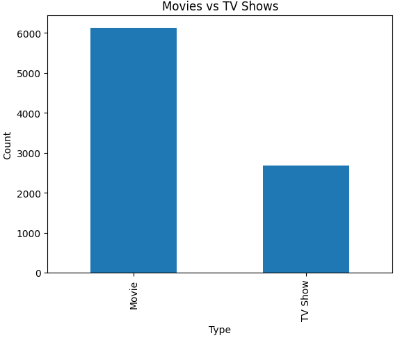
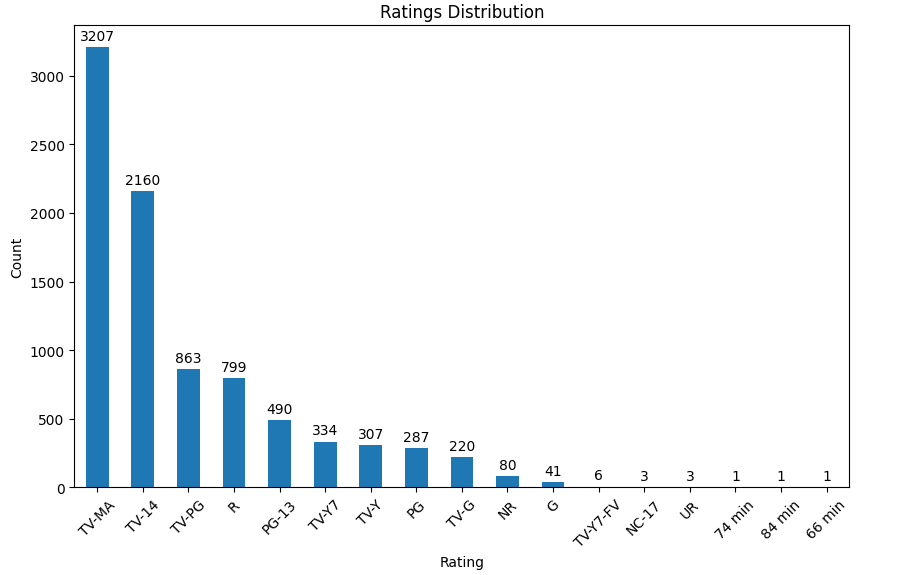

# Netflix Data Analysis using Python

## Project Overview

This project explores the Netflix Titles dataset using Python to perform **Exploratory Data Analysis (EDA)**. The objective is to uncover trends in Netflix's content library, including the distribution of Movies and TV Shows, popular genres, country-wise content availability, content ratings, release trends, and movie durations.

The project demonstrates data cleaning, analysis, and visualization using Python libraries such as Pandas and Matplotlib.

---

## Objectives

* Load and explore the Netflix dataset.
* Clean and preprocess the data.
* Analyze Movies vs TV Shows.
* Identify the most common genres.
* Analyze content distribution by country.
* Explore content ratings.
* Study release year and content addition trends.
* Analyze movie durations.
* Identify the directors with the most titles.
* Present findings using clear visualizations.

---

## Dataset

**Dataset:** Netflix Titles Dataset

The dataset contains information such as:

* Show ID
* Type (Movie / TV Show)
* Title
* Director
* Cast
* Country
* Date Added
* Release Year
* Rating
* Duration
* Genre
* Description

---

## Tools & Libraries

* Python
* Pandas
* Matplotlib
* Jupyter Notebook

---

## Analysis Performed

### Data Exploration

* Loaded the dataset
* Checked data types
* Explored dataset dimensions
* Identified missing values
* Removed duplicate records

### Exploratory Data Analysis

* Movies vs TV Shows
* Top 10 Genres
* Top Countries
* Ratings Distribution
* Release Year Trend
* Content Added by Year
* Movie Duration Distribution
* Top Directors

---

## Visualizations

The project includes the following charts:

* Movies vs TV Shows (Bar Chart)
* Movies vs TV Shows (Pie Chart)
* Top 10 Genres
* Top Countries
* Ratings Distribution
* Netflix Release Trend
* Content Added by Year
* Movie Duration Distribution
* Top Directors

---

## Key Insights

* Movies make up a larger portion of Netflix's catalog than TV Shows.
* Drama and International content are among the most common genres.
* The United States contributes the highest number of titles.
* TV-MA and TV-14 are the most common content ratings.
* Netflix experienced rapid content growth after 2015.
* Most movies have a runtime between 80 and 120 minutes.
* A few directors have multiple titles, while most have only one.
* Data cleaning was necessary due to missing values in several columns.

---

## Project Structure

```
netflix-data-analysis/
│
├── netflix_titles.csv
│
├── netflix_data_analysis.ipynb
│
├── images/
│   ├── movies_vs_tvshows.png
│   ├── top_genres.png
│   ├── top_countries.png
│   ├── ratings_distribution.png
│   ├── release_trend.png
│   ├── content_added_year.png
│   ├── movie_duration.png
│   └── top_directors.png
│
├── README.md
└── requirements.txt
```

---

## How to Run

1. Clone this repository.
2. Install the required libraries:

```bash
pip install pandas matplotlib openpyxl
```

3. Open the Jupyter Notebook.
4. Run all cells to reproduce the analysis and visualizations.

---

## 📷 Dashboard / Charts

Add screenshots of your charts inside the `images` folder and display them here.

Example:

```markdown




```

---

## Future Improvements

* Create an interactive dashboard using Power BI or Tableau.
* Perform sentiment analysis on movie descriptions.
* Build a recommendation system.
* Analyze trends by genre and country over time.
* Develop an interactive dashboard using Plotly.

---

## Author

**Yash Agrawal**

Aspiring Data Analyst passionate about transforming data into actionable insights using Python, Excel, SQL, and data visualization tools.
